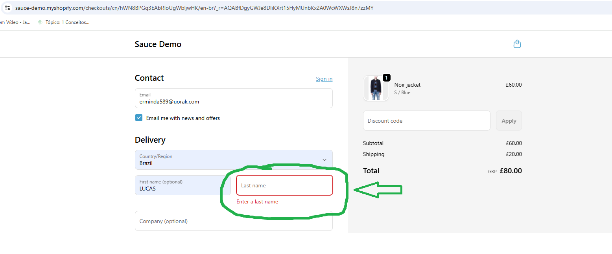

# PROJETO DE TESTES - SOUCE DEMO

--

# Negative Testing

##  Objetivo: Validar o fluxo principal de compra e regras de negócio do e-commerce SauceDemo.

### CT-01: Validar erro no checkout (Campo obrigatório)
**Dado** que o usuário está na tela "Checkout: Your Information"
**Quando** deixa o campo "Last Name" vazio e clica em "Continue"
**Então** o sistema deve exibir a mensagem de erro: "Error: Last Name is required".
**Resultado Obtido:** Sucesso 

####  Evidências de Teste:

##### Bug/Validação: Campo "Last Name" obrigatório

  ---

#  Casos de Teste Avançados (Edge Cases)

## Objetivo: Verificar se o sistema mantém a integridade dos dados do carrinho quando manipulado em diferentes abas.

### CT-02: Sincronização de Sessão Multi-abas
**Dado** que o usuário está com o Checkout aberto (Aba A)
**E** adiciona um novo item ao carrinho em outra aba (Aba B)
**Quando** realiza o refresh (F5) na página de Checkout (Aba A)
**Então** o sistema deve exibir o novo item e atualizar o valor total do resumo da compra.
**Resultado Obtido:** Sucesso 
